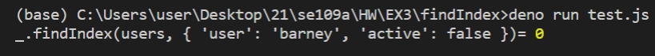
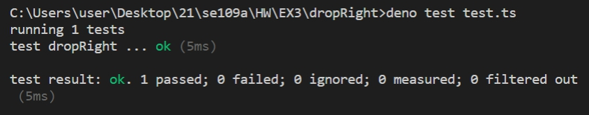
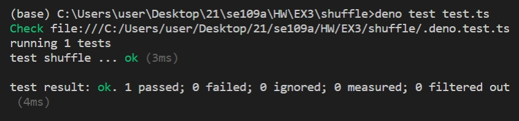

# 寫三個lodash並進行測試
參考<https://siddharam.com.tw/post/20190423/>的程式及自行撰寫測試 
## _.findIndex
[程式碼](findIndex/findIndex.js)
[傳統測試檔](findIndex/test.js) 
測試結果: 

## _.dropRight
[程式碼](dropRight/dropRight.ts)
[測試檔](dropRight/test.ts) 
測試結果: 

## _.shuffle
[程式碼](shuffle/shuffle.ts)
[測試檔](shuffle/test.ts) 
測試結果: 

