# git上課筆記(2020/10/07 part1)

## git
git 是一個版本管理工具<br>
就像電腦的時光機，可以回到任何時間點<br>

## 1.讓git1變成git資料夾
創建一個資料夾git1<br>
對git1 做git init 讓git1變成git資料夾<br>
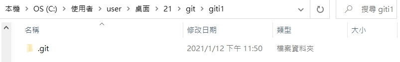<br>
如果做了add或commit等動作都會記錄在.git資料夾中<br>

## 2 git status
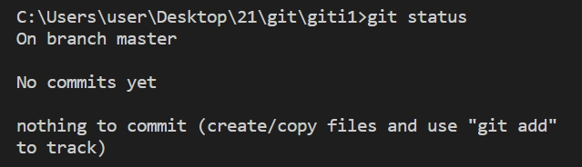<br>
目前在master這個分支<br>
目前沒有任何commit (因為是新的資料夾)<br>

## 3.增加README.md
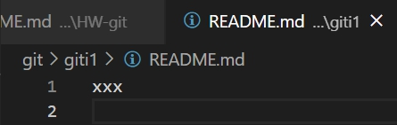<br>
再做一次 git status<br>
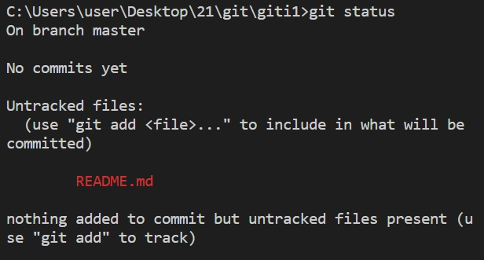<br>
顯示多了一個README檔案，且未被納入暫存區內<br>
做git add README.md，將README.md納入暫存區<br>
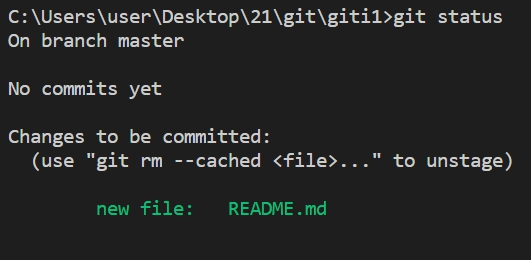<br>
顯示有一個新檔README.md，但還沒進入永久資料庫<br>
做git commit -m "create README.md"，將README.md納入本地的永久資料庫<br>
再做一次 git status<br>
<br>
代表目前版本被完整送出了<br>
做 git log<br>
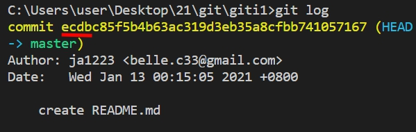<br>
可以用前4碼(紅色底線的部分)代表這個commit<br>

## 4.修改README.md
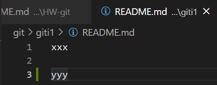<br>
做 git status<br>
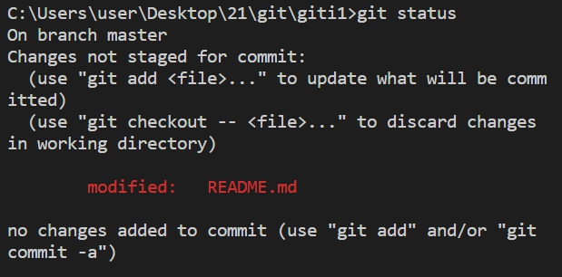<br>
顯示README被修改了，且未被納入暫存區內<br>
做 git add README.md<br>
再做 git status<br>
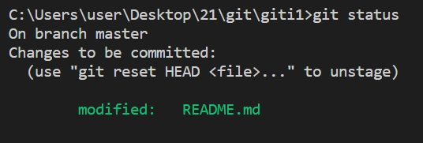<br>
顯示README被修改了，但還沒進入永久資料庫<br>
做git commit -m "modify README.md add yyy"，將README.md納入本地的永久資料庫<br>
再做一次 git log<br>
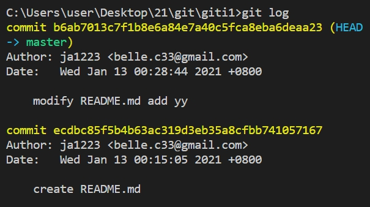<br>
變成有2個commit，也就是有2個版本<br>

## 5.版本管理(時光機)功能
做git checkout ecdb ,回到README只有打xxx的版本<br>
```ecdb是README只有打xxx那個commit的代號前4碼```<br>
README內容回到上一版的狀態<br>
<br>
再打一次git log ，會只剩下一個commit<br>
<br>
再做一次 git checkout b6ab，就能夠回到README有xxx跟yyy的版本<br>
如果打git log --all，就會出現所有commit版本<br>
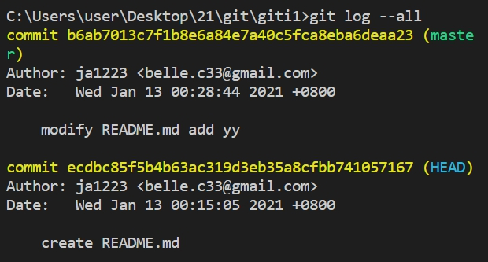<br>
可以看到目前的最新版(master)及目前所在的版(HEAD)
做 git status，會顯示目前在ecdb這個版本<br>
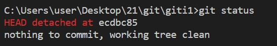<br>

## 6.創建featureA分支
做git checkout master ,回到master的那個版本<br>
打git branch ,會顯示目前所在的branch<br>
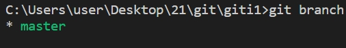<br>
```master通常就是最新版```<br>
做git branch featureA ,新增一個叫featureA的分支<br>
再做一次git branch ,可以看到多了一個featureA的分支<br>
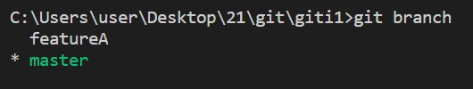<br>
而前面有加 * 的才是目前所在的分支<br>
做git checkout featureA ,切換到featureA的分支<br>
再做一次git branch ,可以看到已經切換到featureA的分支<br>
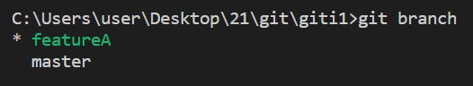<br>
到README中加入一行featureA<br>
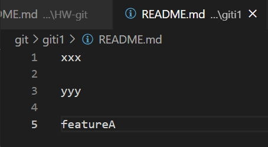<br>
做git add README.md，將README.md納入暫存區<br>
做git commit -m "modify README.md add featureA"，將README.md納入本地的永久資料庫<br>
做git log, 會看到3個commit<br>
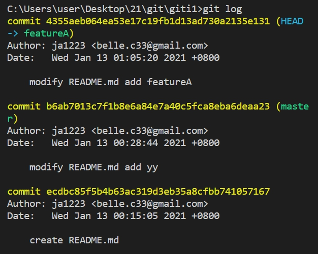<br>
做git checkout master<br>
會看到README回到只有xxx跟yyy的版本<br>
<br>
再做一次git branch ,可以看到已經切換到master的分支<br>
<br>
如果想將featureA的內容合併進master<br>
打 git merge featureA<br>
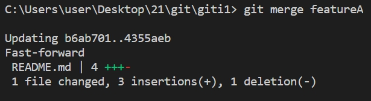<br>
```只有分支才可以merge```
開啟README就可以發現兩個版本合併了<br>
<br>
再做一次git log ,就可以看到有一版是將featureA併入master<br>
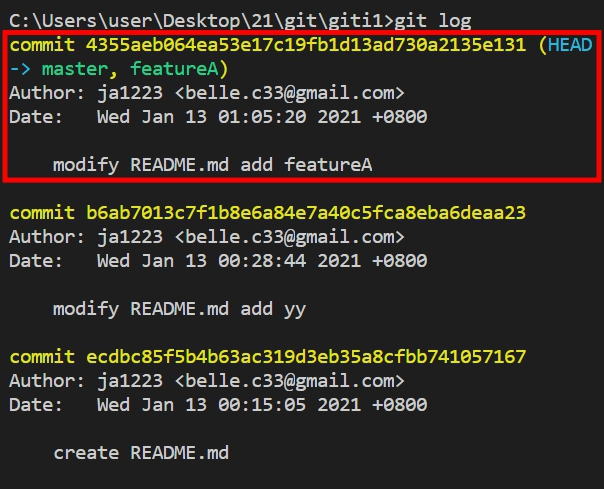<br>

# git上課筆記(2020/10/07 part2)

## 1.創建featureB分支
做git branch featureB ,新增一個叫featureB的分支<br>
再做一次git branch ,可以看到多了一個featureB的分支<br>
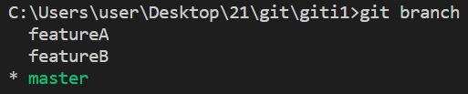<br>
打git checkout featureB , 切換到featureB這個分支<br>
在README中加入一行featureB
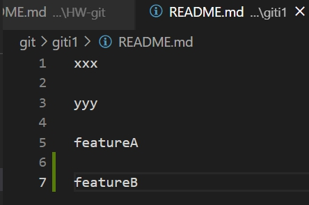<br>
做git add . ，將資料夾下的檔案納入暫存區<br>
```
git add -A 無視資料夾全部納入暫存區
git add .  資料夾下的檔案納入暫存區
git add README.md 只將README.md納入暫存區
```
做git log, 可以看到第一個commit是在featureB底下，且之前merge過master跟featureA<br>
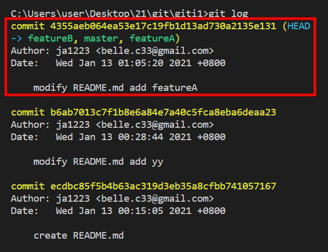<br>
做git commit -m "featureB finished"，將featureB納入本地的永久資料庫<br>
做git branch ,可以看到目前是是在featureB分支<br>
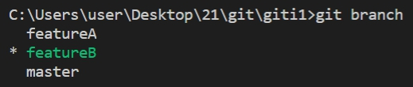<br>
如果想將featureB的內容合併進master,要先切換回master分支<br>
所以要做git checkout master, 切換回master分支<br>
做git branch ,可以看到已經切換到master的分支<br>
<br>
```
merge的時候要注意身分，是用master的身分去merge別人
所以要記得切換回master!
```
打 git merge featureB<br>
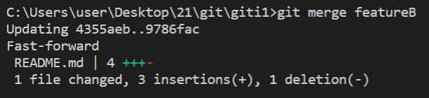<br>
開啟README就可以發現版本合併了<br>
<br>
